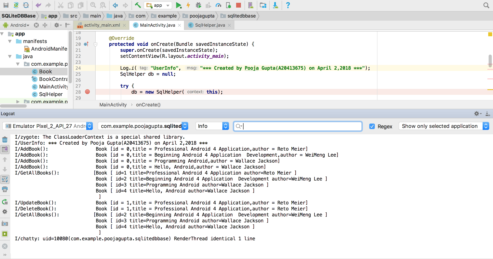

# SQLite usage in Android

**SQLite Usage in Android (Basic Example) **
_`This application has basic CRUD operations for a database. The database is created using SQLite`_

### Below are the snapshots of the working application

###### 1. Below image shows shows the logs which displays all the operations being performed on the application.
  
  
