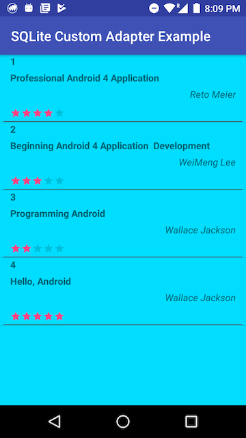
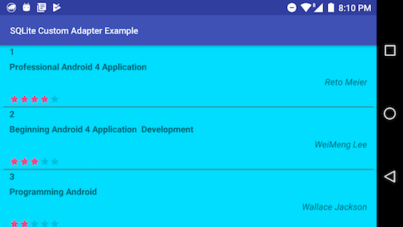
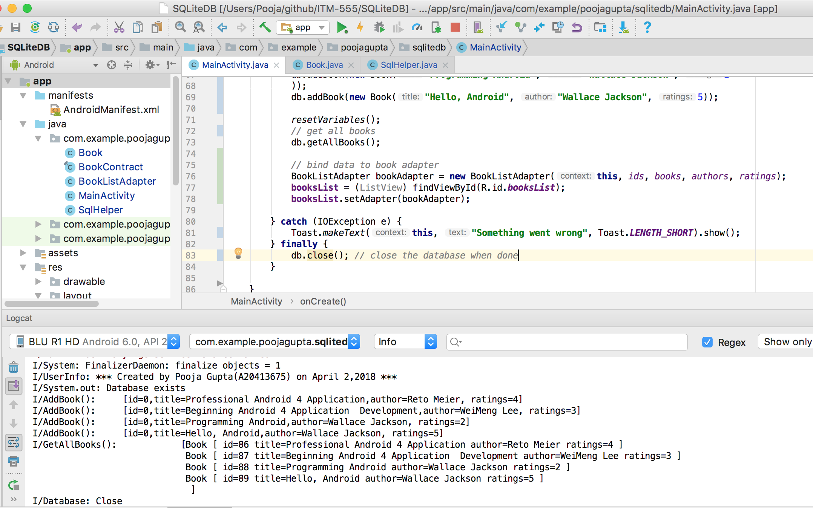

## SQLiteDB with Custom Adapter

_`This application shows how the books data (title,author and ratings) is fetched from SQLite database and rendered on a custom list adapter. The database file is created using SQLite firefox plugin`_

### Below are the snapshots of the working application

###### 1. Below images show rendered list in horizontal and landscape view.
  

  
  
###### 2. Below images shows logs which have been displayed on the console.  
  

