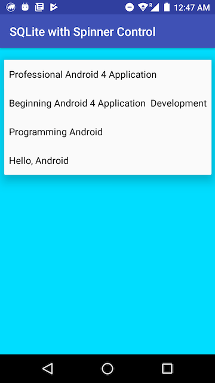
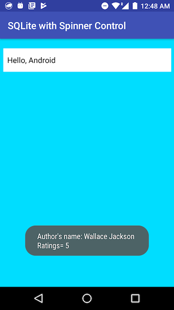
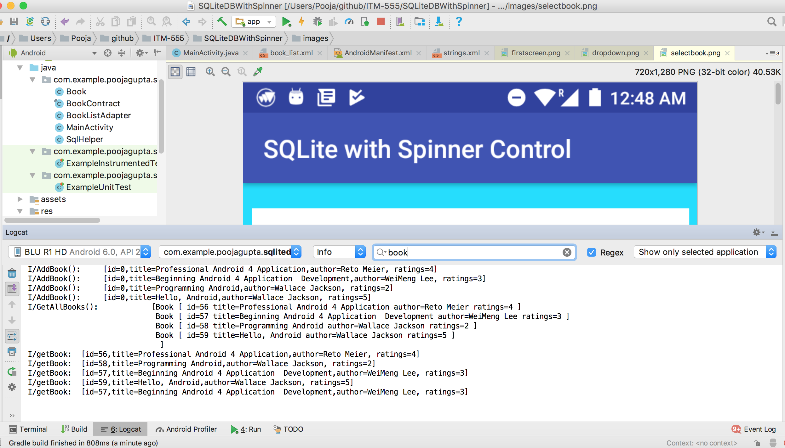
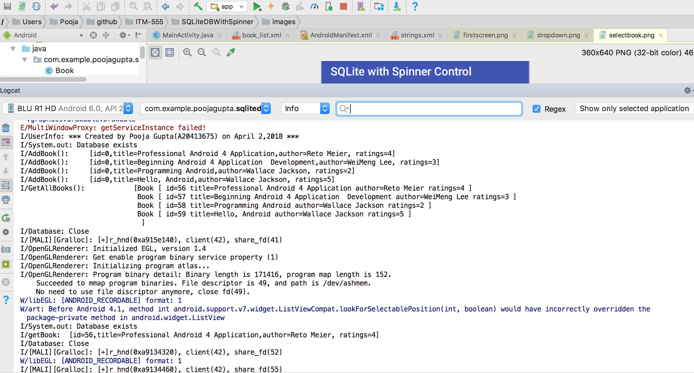

## SQLiteDB with Spinner control

_`This application shows how the books data fetched from SQLite database serves as the data for the spinner contro. User select a book from the dropdown to see other details in the form of an alert message(Toast)`_

### Below are the snapshots of the working application

###### 1. Below image shows landing page of the application.This is a dropdown which when selected will show other options as shown in next image
  

  
  
###### 2. Below image shows all the options for the user to select. This is infact all the books which are present in SQLite database   
  
  
###### 3. Below image shows books details as an alert when an option from dropdown is selected.
  

###### 4. Below image shows filtered and unfiltered logs captured during application execution.
  
  
