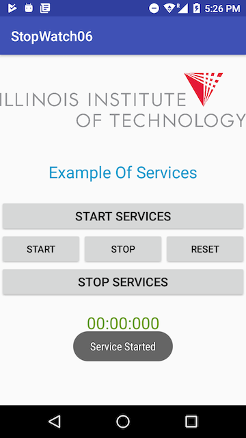
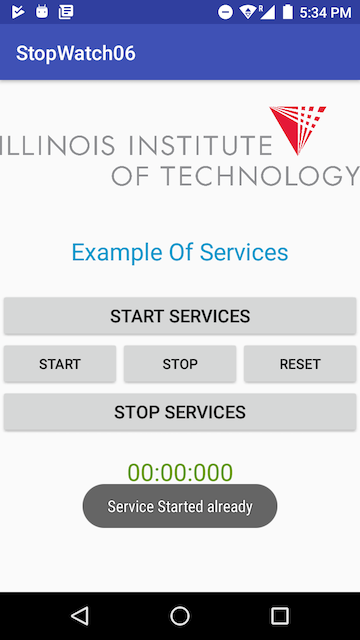
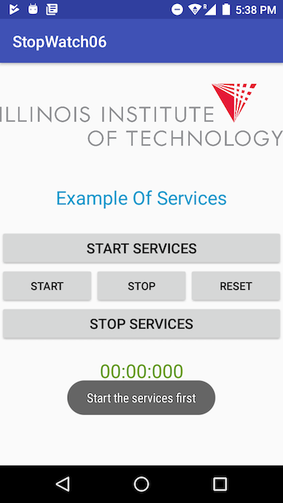

## Week-06
**STOP WATCH**
_`This application is a stop watch created utilizing Bound Services of Android. This will allow user to start, stop and reset timer. In order to start using the timer user must first start the services and must stop the services once done.`_

### Below are the snapshots of the working application

###### 1. Below image shows the starting page of the application.
  
  
###### 2. Below image shows the screen of the application when user clicks on `Start Services` button. This will allow the user to start the timer.  
  

###### 3. Below image shows the screen of the application when user clicks on `Start Services` button again. This lets the user know that the service is already runnning.  
  

###### 4. Below images shows the screen of the application when user clicks on `Start` button. This will start the timer.  
  

  
  
###### 6. Below image shows the screen of the application when user clicks on `Stop` button. This will stop the timer.  
  
  
###### 7. Below image shows the screen of the application when user clicks on `Reset` button. This will reset the timer.  
    
  
###### 8. Below image shows the screen of the application when user clicks on `Stop Services` button. This will stop the service and reset the timer.  
    
  
###### 8. Below image shows the screen of the application when user clicks any of the `Start`, `Stop`, `Reset`,`Stop Services` button before the service is started. This tells the user to start the service first before clicking on the button.  
    
