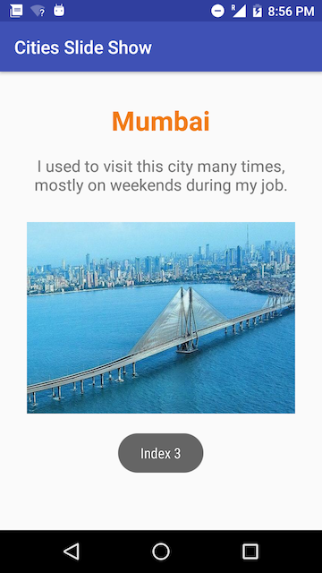

## Week-05
**SlideShow of Images**
_`This application will allow user to select time in seconds using a seekbar and will show slideshow of the images with a time difference matching to the time selected`_

### Below are the snapshots of the working application

###### 1. Below images show the starting page of the application.This screen allows user to select time in seconds (default is set to 5).Minimum time which can be selected is 2 seconds and maximum is 30 seconds. User clicks on the button "Start SlideShow" to go to the next page and see the slideshow.
  

  
  
###### 2. Below images show the second screen of the application where user can see slideshow of the images at an interval set in the first page of the application using the seekbar. User can anytime go back, set the time and see the slideshow with a new time interval.  
  

  

  

  
